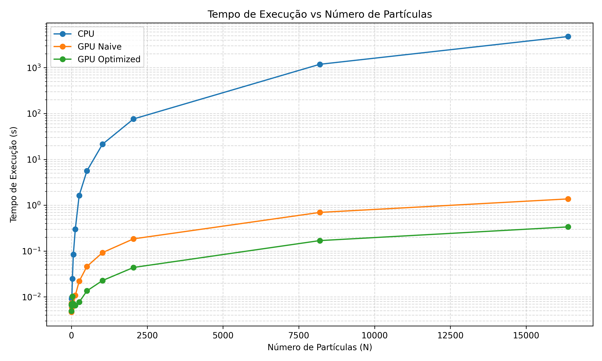
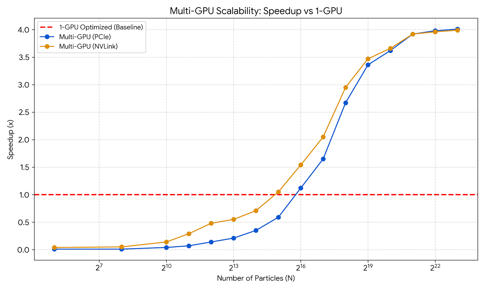

# N-Body Simulation: CPU vs GPU & Multi-GPU Optimization


This project implements an N-Body simulation to benchmark and compare the performance of CPU (NumPy), single-GPU, and Multi-GPU architectures. It explores iterative optimizations on a single GPU (Fast Math, Shared Memory, Float4 Vectorization) and evaluates the scalability of parallelizing the workload across multiple GPUs using standard PCIe vs. NVLink/NVSwitch.

<!-- ## Key Findings
* **Iterative GPU Optimization:** Upgrading from a naive GPU implementation to Shared Memory + Float4 Vectorization resulted in an **XX%** increase in processing speed.
* **NVLink vs PCIe:** Distributing the workload across 4 GPUs using NVLink/NVSwitch scaled almost linearly, outperforming standard PCIe peer-to-peer memory transfers by **XXx**.
* **CPU vs GPU:** The fully optimized single-GPU implementation processed the simulation **XXx** faster than the baseline NumPy CPU engine. -->

## Hardware Tested On
- **GPUs:** NVIDIA HGX A100 (4x A100 SXM4 80GB) with NVLink/NVSwitch interconnection.
- **CPUs:** AMD EPYC 7453.

## Benchmark Results

### Execution times: CPU vs Single-GPU vs Optimized Single-GPU


### Speedup: Optimized Single-GPU (Baseline) vs PCIe vs NVLink


## Installation

```bash
pip install pycuda matplotlib numpy
```

*(`matplotlib` is used for generating the performance graphs and simulation visualizations).*

## Project Structure & Engines

The core simulation logic is divided into different engines located in the `/engines/` directory:

- **`cpu.py`**: Baseline NumPy implementation running on the CPU.
- **`gpu.py`**: Single-GPU implementations featuring progressive optimizations:
   - *Naive*: Direct PyCUDA implementation.
   - *Math Intrinsics*: Replacing standard `pow()` functions with hardware-accelerated `rsqrtf()` (fast reciprocal square root) for force calculations.
   - *Shared Memory (includes Intrinsics)*: Tiling approach to reduce global memory accesses.
   - *Shared Mem + Float4 (includes Intrinsics)*: Vectorized memory accesses for maximum bandwidth utilization.
- **`multigpu.py`**: Distributed Multi-GPU implementation using standard PCIe communication.
- **`nv4.py`**: Highly optimized Multi-GPU implementation leveraging NVLink/NVSwitch for direct Peer-to-Peer (P2P) memory access.

## Running the Benchmarks

1. **Compare CPU with various Single-GPU optimizations:**
   ```bash
   python benchmarks/cpu_vs_gpu_vs_optimized.py
   ```

2. **Test Multi-GPU scalability (PCIe vs NVLink):**
   ```bash
   python benchmarks/gpu_vs_pcie_nvlink.py
   ```

3. **Run simple benchmark for a constant N across all implementations:**
   ```bash
   python main.py
   ```
